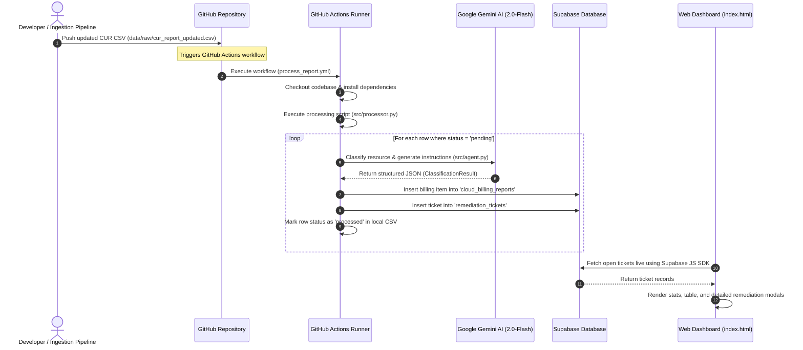

# Cloud Cost Guardian

Cloud Cost Guardian is an automated, AI-driven cloud waste classification and remediation assistant. It ingests AWS Cost and Usage Reports (CUR), classifies cloud resource waste using Gemini 2.0 Flash, inserts structured billing reports and remediation tickets into Supabase, and visualizes everything on a sleek, real-time web dashboard.

---

## 🏗️ Architectural Flow & Workflow Automation

The system utilizes a GitOps/event-driven architecture. The automated flow is illustrated below:



### 1. Ingestion & Trigger Layer
- **Source**: A CSV-formatted Cost and Usage Report (CUR) located at `data/raw/cur_report_updated.csv`.
- **Trigger**: Pushing updates to the CSV file or manually starting the workflow triggers the GitHub Actions runner (`.github/workflows/process_report.yml`).

### 2. Processing & Reasoning Layer (`src/processor.py` & `src/agent.py`)
- **Filtering**: The processor scans the CSV file for rows marked with a `pending` status.
- **LLM Reasoning**: Each pending row is compiled into a JSON string and sent to the Google Gemini API using `gemini-2.0-flash`.
- **Structured Schema**: Gemini returns a structured JSON response corresponding to the following Pydantic model:
  - `bucket`: Category of waste (`Idle Resource`, `Oversized/Rightsizing`, `Orphaned Resource`, `Misconfigured/Non-compliant`).
  - `reasoning`: Brief explanation of why the category was selected.
  - `resolver_group`: Assigned engineering group (`DevOps/Compute Team`, `Storage & Database Team`, `Security & Compliance Team`, `Finance Team`).
  - `ticket_title`: Action-oriented title.
  - `ticket_description`: Step-by-step instructions to remediate the wastage.
  - `severity`: Priority level (`Low`, `Medium`, `High`, `Critical`).

### 3. Storage Layer (`src/db_manager.py`)
- Structured outputs are persisted in Supabase across two tables:
  - **`cloud_billing_reports`**: Stores full billing line-item details.
  - **`remediation_tickets`**: Registers open action items for engineering teams.
- The local CSV file is updated concurrently (setting `status` to `processed` and writing the AI `decision` to the row) to prevent re-processing.

### 4. Visualization Layer (`index.html`)
- A modern, static web dashboard built using HTML and vanilla CSS.
- Connects directly to Supabase via the client SDK to fetch open remediation tickets in real-time.
- Shows key statistics (Total savings, ticket count, high severity alerts) and provides interactive detail modals for each ticket.

---

## 🚀 Step-by-Step Replication & Setup Guide

Follow these instructions to replicate the entire environment, from database configuration to automated pipeline runs.

### 📋 Prerequisites
1. **Python 3.10+** installed locally.
2. A **Supabase** account (Free tier is sufficient).
3. A **Google Gemini API Key** (obtainable from Google AI Studio).

---

### 1. Database Setup (Supabase)
Log in to your Supabase console, create a new project, and navigate to the **SQL Editor**. Run the following SQL queries to initialize your schema:

```sql
-- 1. Create the Cloud Billing Reports table
CREATE TABLE IF NOT EXISTS public.cloud_billing_reports (
    id BIGSERIAL PRIMARY KEY,
    resource_id TEXT,
    product_code TEXT,
    unblended_cost NUMERIC(12, 4),
    billing_start_date TIMESTAMPTZ,
    billing_end_date TIMESTAMPTZ,
    usage_account_id TEXT,
    usage_type TEXT,
    usage_amount NUMERIC(16, 6),
    line_item_description TEXT,
    region TEXT,
    bucket_category TEXT,
    ai_reasoning TEXT,
    resolver_group TEXT,
    status TEXT DEFAULT 'processed',
    created_at TIMESTAMPTZ DEFAULT NOW()
);

-- 2. Create the Remediation Tickets table
CREATE TABLE IF NOT EXISTS public.remediation_tickets (
    id BIGSERIAL PRIMARY KEY,
    resource_id TEXT,
    product_code TEXT,
    unblended_cost NUMERIC(12, 4),
    bucket_category TEXT,
    ai_reasoning TEXT,
    resolver_group TEXT,
    ticket_title TEXT,
    ticket_description TEXT,
    severity TEXT,
    status TEXT DEFAULT 'open',
    created_at TIMESTAMPTZ DEFAULT NOW()
);

-- 3. Enable read access for dashboard queries (Optional depending on your RLS settings)
-- If Row Level Security (RLS) is enabled, make sure to add a SELECT policy for anon users:
ALTER TABLE public.remediation_tickets ENABLE ROW LEVEL SECURITY;
CREATE POLICY "Allow public read access" ON public.remediation_tickets FOR SELECT USING (true);
```

---

### 2. Local Environment Setup

1. **Clone the repository** and navigate to the project directory:
   ```bash
   git clone <your-repo-url>
   cd cloud-cost-guardian
   ```

2. **Install dependencies**:
   ```bash
   pip install -r requirements.txt
   ```

3. **Configure Environment Variables**:
   Create a `.env` file in the root directory (you can copy `.env.example` as a template):
   ```env
   # Supabase Configuration
   SUPABASE_URL=https://<your-project-id>.supabase.co
   SUPABASE_KEY=<your-anon-or-service-role-key>

   # Google Gemini API Key
   GEMINI_API_KEY=<your-gemini-api-key>
   ```

4. **Run the processor locally**:
   ```bash
   python src/processor.py
   ```
   *This reads the CSV at `data/raw/cur_report_updated.csv`, processes any rows marked `pending`, saves the output to your Supabase tables, and updates the local CSV.*

---

### 3. GitHub Actions Pipeline Automation
To automate processing whenever a new CSV report is pushed, set up GitHub Secrets:

1. On GitHub, go to your repository: **Settings** -> **Secrets and variables** -> **Actions**.
2. Click **New repository secret** and add the following three secrets:
   - `SUPABASE_URL`: Your Supabase project URL.
   - `SUPABASE_KEY`: Your Supabase API key (anon key or service role key).
   - `GEMINI_API_KEY`: Your Google Gemini API key.
3. Every time you push changes to `data/raw/cur_report_updated.csv`, the GitHub Actions workflow will automatically run the Python processing agent.

---

### 4. Viewing the Dashboard
1. Open the [index.html](file:///c:/Users/keysh/github/cloud-cost-guardian/index.html) file locally in any web browser.
2. In the Javascript block (around line 619), configure the `SUPABASE_URL` and `SUPABASE_ANON_KEY` variables to match your Supabase project:
   ```javascript
   const SUPABASE_URL = 'https://<your-project-id>.supabase.co';
   const SUPABASE_ANON_KEY = '<your-public-anon-key>';
   ```
3. The dashboard will automatically fetch open remediation tickets and potential savings in real-time. Click on any row to open the details modal containing AI analysis and step-by-step remediation tasks.